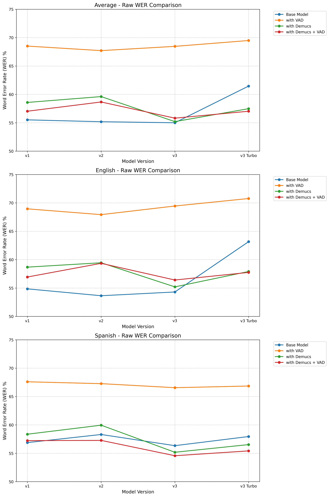

# STT Research Project

> [!IMPORTANT]  
> This project is currently in progress. Updates will be posted over time as results come back.

## Introduction
TODO

## Dataset

The dataset consists of 39,886 audio files, with 831 files reserved for testing (used in the benchmarks below) and 39,055 files for training. The dataset is multilingual, comprising approximately 58.2% English, 28.5% Spanish, and the remaining 13.3% distributed across 18 other languages.

## Benchmarks
| Model                  | WER Type  | Average   | en        | es        | ko        | pt        |
| ---------------------- | --------- | --------- | --------- | --------- | --------- | --------- |
| Whisper Large v1       | Raw       | 56.35     | 54.85     | 56.88     | 74.02     | 62.27     |
|                        | Filtered‡ | 51.58     | 50.24     | 52.00     | 70.65     | 52.21     |
| └─with VAD             | Raw       | 68.87     | 68.95     | 67.60     | 80.40     | 63.08     |
|                        | Filtered‡ | 67.65     | 68.04     | 65.76     | 80.40     | 57.88     |
| └─with Demucs          | Raw       | 59.43     | 58.68     | 58.36     | 79.75     | 65.13     |
|                        | Filtered‡ | 51.54     | 49.82     | 52.94     | 72.56     | 54.91     |
| └─with Demucs + VAD    | Raw       | 58.11     | 56.94     | 57.23     | 82.77     | 67.24     |
|                        | Filtered‡ | 51.15     | **49.57** | 51.60     | 71.43     | 57.16     |
| Whisper Large v2       | Raw       | 55.91     | 53.64     | 58.31     | 72.10     | 61.31     |
|                        | Filtered‡ | 51.53     | 49.94     | 51.62     | 71.14     | 51.27     |
| └─with VAD             | Raw       | 68.19     | 67.93     | 67.27     | 83.10     | 63.54     |
|                        | Filtered‡ | 67.09     | 67.42     | 65.38     | 80.80     | 57.66     |
| └─with Demucs          | Raw       | 60.49     | 59.45     | 59.95     | 80.76     | 64.86     |
|                        | Filtered‡ | 52.31     | 50.71     | 53.01     | 72.83     | 54.62     |
| └─with Demucs + VAD    | Raw       | 59.35     | 59.35     | 57.27     | 75.55     | 62.19     |
|                        | Filtered‡ | 51.59     | 50.12     | 51.53     | 69.17     | **48.51** |
| Whisper Large v3       | Raw       | 55.54     | 54.30     | 56.34     | 66.71     | 61.01     |
|                        | Filtered‡ | 51.96     | 51.33     | 50.80     | 66.71     | 51.05     |
| └─with VAD             | Raw       | 68.77     | 69.45     | 66.56     | 79.16     | 63.83     |
|                        | Filtered‡ | 67.64     | 68.70     | 64.78     | 79.16     | 57.70     |
| └─with Demucs          | Raw       | 56.05     | 55.20     | 55.18     | 67.12     | 75.23     |
|                        | Filtered‡ | 51.69     | 50.68     | 50.82     | 67.12     | 56.97     |
| └─with Demucs + VAD    | Raw       | 56.61     | 56.41     | 54.57     | 68.68     | 72.07     |
|                        | Filtered‡ | **50.74** | 50.05     | **50.06** | **64.73** | 52.34     |
| Whisper Large v3 Turbo | Raw       | 62.03     | 63.16     | 57.95     | 79.59     | 63.00     |
|                        | Filtered‡ | 53.66     | 53.30     | 52.44     | 74.87     | 53.30     |
| └─with VAD             | Raw       | 69.89     | 70.77     | 66.85     | 85.04     | 66.21     |
|                        | Filtered‡ | 68.68     | 70.02     | 65.11     | 82.31     | 60.52     |
| └─with Demucs          | Raw       | 58.08     | 57.91     | 56.53     | 76.70     | 64.18     |
|                        | Filtered‡ | 53.70     | 54.30     | 51.50     | 70.94     | 51.65     |
| └─with Demucs + VAD    | Raw       | 57.80     | 57.75     | 55.42     | 77.90     | 70.75     |
|                        | Filtered‡ | 52.54     | 52.27     | 51.25     | 71.06     | 54.49     |

> [!NOTE]
> - [Demucs](https://github.com/adefossez/demucs) refers to the `htdemucs` model being applied to the source audio file before transcription
> - Filtered‡ refers to WER scores with outliers removed using the IQR method (`Q1 - 1.5*IQR, Q3 + 1.5*IQR`)
